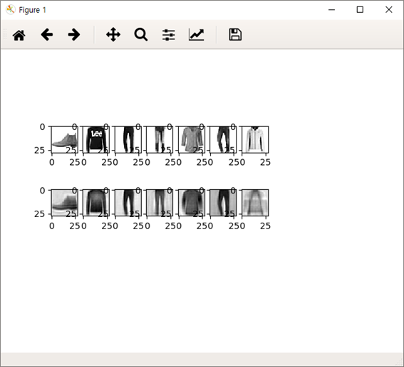

# AutoEncoder
__Ver_ENG__

this python script is autoencoder for mnist datasets and  
simple autoencoder that didn't use CNN(Convolution Neural Network.)
but it is pretty good worked.(only simple data.)

more information for this mnist datasets see this site. 
 tensorflow site : https://www.tensorflow.org/tutorials/keras/basic_classification

# training & comparing original dataset with decoded dataset.
<pre>
<code>
python training [flatted | normal]
</code>
</pre>
__arguments__ 
[flatted] : flat original data(2D [28, 28]) to 1D data[28*28]. 
[normal] use origin data shape[28, 28]

__notice!__ 
I don't used code for weight saving(a.k.a tf.saver)
if you want to save weights. insert code for saving data!

# example

using [flatted] argument 
low performance(can't recognize feature of clothes in detail. Only the outline of clothes has been learned.)

 
 
 
using [normal] argument 
better performance than using flatted arguments

# etc
autoencoder.py is an unused file. please using the other files.
actually mnist_autoencoder.py is made of autoencoder.py. (it is a file that has been structured)

